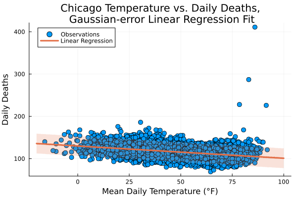
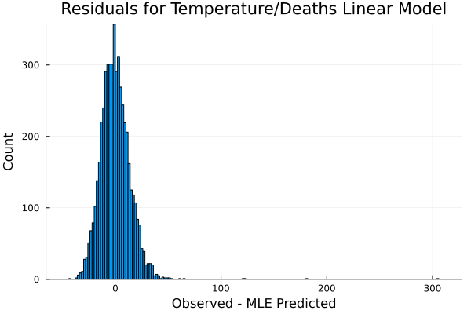
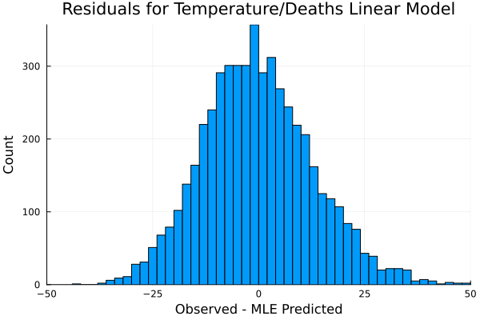
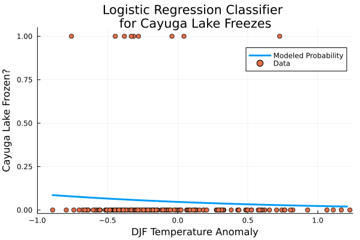
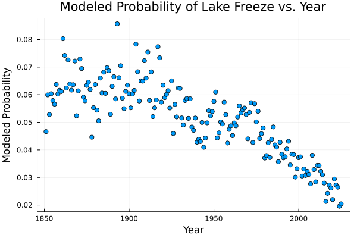
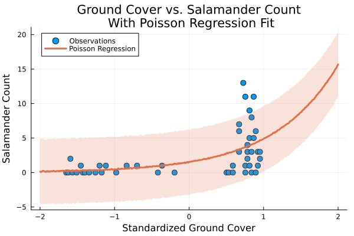
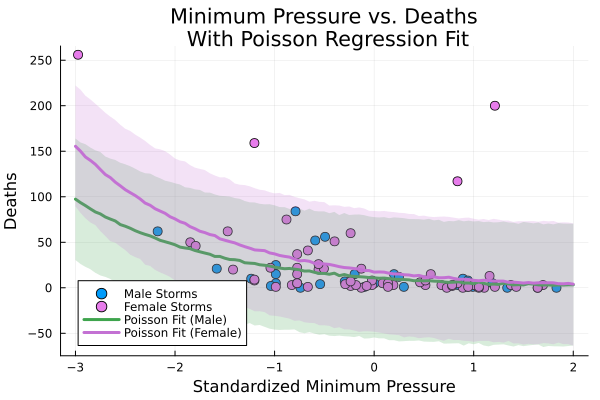
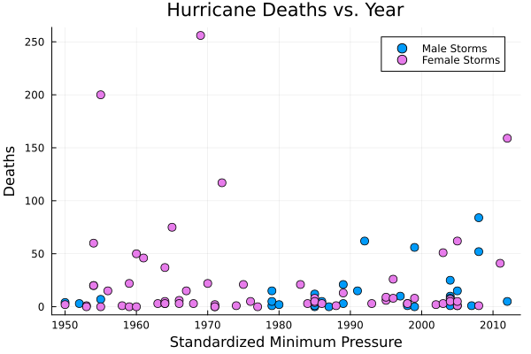

::: {.callout-note}
All of the code used in this homework is accessible in the hw02.ipynb file in my GitHub repository. Note that this is different to last week where all of the code was in the .qmd file.
:::
```{=latex}
\newpage
```
# Problem 1: Chicago Deaths & Linear Regression
### Problem 1.1

::: {#fig-11 layout-nrow=2}
{#fig-pm25 height=2.5in}

{#fig-so2 height=2.5in}

{#fig-o3 height=2.5in}

{#fig-temp height=2.5in}

Relationships between daily observed values of
(a) pm~25~ ; (b) SO~2~ ; (c) O~3~ ; (d) Mean Daily Temperature 
and the daily number of deaths in Chicago.
:::

Most of the bivariate relationships do not appear very strong, if they exist at all. @fig-pm25 appears to show a very slight positive linear relationship between pm~25~ density and daily deaths, but there are many missing data points for this predictor variable, making it difficult to examine the relationship. @fig-so2 appears to show little to no relationship between SO~2~ concentration and daily deaths, and @fig-o3 shows a similarly small relationship; for both of these predictors, the number of deaths does not appear to increase or decrease much as the predictor increases. Finally, @fig-temp appears to show a linear, negative bivariate relationship between temperature and daily deaths, with the exception of several high outliners during the 1995 Chicago Heat Wave[^1]. Temperature is probably most appropriate for a linear regression model given its visually apparent nonzero linear trend.

[^1]: <https://www.weather.gov/lot/1995_HeatWave> 


```{=latex}
\newpage
```
### Problem 1.2

The Gaussian-error linear regression model being fit in this problem is:
$$
y_{\text{deaths}} = \beta_{0} + \beta_{1}\cdot x_{tmpd} + \varepsilon_{i}
$$
Where the error is:
$$ \varepsilon \sim N(0,\sigma^{2}) $$
Using Julia's `Optim` package to compute the Maximum Likelihood Estimators for this linear regression model with `tmpd` as the predictor and `death` as the response variable, the regression coefficients and error variance are:
$$\beta_{0} = 129.96 \qquad \beta_{1} = -0.28964 \qquad \sigma^{2} = 202.32$$
In the context of this problem, $\beta_{0}$ implies the model predicted number of deaths when the temperature is 0°F is about 130, and $\beta_{1}$ implies the expected difference in deaths is about -0.3 when the temperature differs by 1°F. 

```{=latex}
\newpage
```
### Problem 1.3

{#fig-tmpd-fit width=4.5in}

Yes, I generally agree with the Gaussian-error linear model assumption. Looking at the scatterplot in @fig-tmpd-fit and the 90% confidence interval on the regression fit, the majority of observations fit within the confidence interval, and those that do not generally lie close to it on either side. We can confirm this by looking at the distribution of residuals, shown below in @fig-13.

::: {#fig-13 layout-ncol=2}

{#fig-resid width=3in}

{#fig-zoom width=3in}

Histogram of residuals for temperature/death linear regression model. Full histogram with oultiers (left) is zoomed in to highlight distribution shape (right). 
:::

Again with the exception of the high outliers, the distribution of residuals is generally Normal, suggesting a Gaussian error assumption is valid. However, the outliers cannot simply be ignored, and the relative inability of the model to capture the possibility of extreme events should be noted.

```{=latex}
\newpage
```
# Problem 2: Cayuga Lake Freezes & Logistic Regression
### Problem 2.1

The logistic regression model being fit in this problem for the probability that Cayuga Lake freezes in a given winter is:
$$ y_{i} \sim \text{Bernoulli}(p_{i}) $$
$$ \text{logit}(p_{i}) = \text{log}(\frac{p_{i}}{1-p_{i}}) = \beta_{0} + \beta_{1} \cdot x_{\text{DJF-Mean}}
$$
Once again using Julia's `Optim` package to compute the MLE values for $\beta_{0}$ and $\beta_{1}$, the regression coefficients are:
$$ \beta_{0} = -3.018 \qquad \beta_{1} = -0.7296 $$
Taking the exponent of the coefficients to aid in their interpretation:
$$ \text{exp}(\beta_{0}) = 0.04891 \qquad \text{exp}(\beta_{1}) = 0.4821 $$
In the context of this problem, $\text{exp} (\beta_{1})$ implies the modeled probability of classifying a Cayuga Lake freeze is 0.4821 times more likely (around half as likely) for a 1°C increase in DJF mean temperature anomaly.

```{=latex}
\newpage
```
### Problem 2.2

::: {#fig-cayuga layout-ncol=2}

{#fig-logreg width=3in}

{#fig-years width=3in}

The modeled probability of Cayuga Lake freezing vs. DJF temperature anomaly (left), and the implied probability of freezing vs. year (right) based on the recorded temperature anomaly in those years.
:::

The model does seem mostly reasonable, showing an increase in the probability of Cayuga Lake freezing over with a more negative temperature anomaly but still a relatively low probability as there are many more years that did not have a freeze than ones that did. One can also check the validity of the model by simulating 175 seasons under the model (the number of years in the dataset) and counting the number of freezes that the model predicts. This logistic regression model predicts about 9 freezes in that 175 year span, matching the 9 freezes observed between 1851 and 2025.

### Problem 2.3

The logistic regression model relates the logit of the probability of Cayuga Lake freezing to the winter temperature anomaly as:
$$ \text{logit}(p_{i}) = \text{log}(\frac{p_{i}}{1-p_{i}}) = \beta_{0} + \beta_{1} \cdot x_{\text{DJF-Mean}} $$
We can rearrange this equation to solve for $x_{\text{DJF-Mean}}$ for a given $p_{i}$, and then substitute in $p_{i} = 0.01$ and our MLE values for $\beta_{0}$ and $\beta_{1}$:
$$ x_{\text{DJF-Mean}} = \frac{(\text{log}(\frac{0.1}{1-0.1}) - \beta_{0})}{\beta_{1}} = 2.162$$
Thus, the modeled winter temperature anomaly required for a less than 1% probability of Cayuga Lake freezing is 2.162°C. 

```{=latex}
\newpage
```
# Problem 3: Salamanders and Poisson Regression
### Problem 3.1
The Poisson regression model being fit in this problem with percentage of ground cover as the predictor and salamander count as the response variable is:
$$ y_{i} \sim \text{Poisson}(\lambda_{i}) $$
$$ \lambda_{i} = \text{exp}(\beta_{0} + \beta_{1}\cdot x_{\text{std-pct-cover}}) $$
Where $x_{\text{std-pct-cover}}$ represents the standardized values of the percentage of ground cover. Once again using Julia's `Optimize` package to find the MLE values for $\beta_{0}$ and $\beta_{1}$, we have:
$$ \beta_{0} = 0.4295 \qquad \beta_{1} = 1.160 $$
Since $\text{exp}(1.160) = 3.190$, $\beta_{1}$ implies that for a 1 standard deviation increase in percentage of ground cover, the model expected number of salamanders increases by a factor of over 3.

```{=latex}
\newpage
```
### Problem 3.2 
{#fig-sal width=4.5in}

The model predicts the observed counts relatively well, with most of the data values falling within the 90% CI. The model does a good job of predicting the increase in salamander counts when the ground cover percentage is above the mean, increasing relatively quickly for large standard values. However, the model does underpredict some of the highest salamander count data points, failing to capture them within the 90% CI. 

### Problem 3.3
No, including forest age as a predictor does not meaningfully improve the model. I determined this by calculating the mean square error of a model without and with forest age as a predictor:
$$ MSE = \frac{1}{n} \sum_{i} (y_{i} - \theta \cdot x_{i})^{2} 
$$
Where $n$ is the number of data points, $\theta = [\beta_{0}, \beta_{1}, (\beta_{2})]$ and $x_{i} = [1, \text{pct-cover}, (\text{fst-age})]$, and the items in parentheses are included in one model but not the other. 

The model without forest age had an MSE of 8.2053, and the model with forest age had an MSE of 8.2049. Thus, the model was not really improved by the inclusion of forest age as a predictor.

```{=latex}
\newpage
```
# Problem 4: Hurricane Misogyny and Poisson Regression
### Problem 4.1 

The Poisson regression model being fit in this problem with `min_pressure` and `female` as the predictors and `deaths` as the response variable is:
$$ y_{i} \sim \text{Poisson}(\lambda_{i}) $$
$$ \lambda_{i} = \text{exp}(\beta_{0} + \beta_{1}\cdot x_{\text{female}} + \beta_{2}\cdot x_{\text{std-min-pressure}}) $$
Where $x_{\text{std-min-pressure}}$ represents the standardized values of the minimum sea level pressure of the hurricane. Using Julia's `Optimize` package to find the MLE values for $\beta_{0}$, $\beta_{1}$, and $\beta_{2}$, we find the regression coefficients as:
$$\beta_{0} = 2.415 \qquad \beta_{1} = 0.4721 \qquad \beta_{2} = -0.7195$$
Since $\text{exp}(0.4721) = 1.603$, $\beta_{1}$ implies that for a female named storm, the model expected number of deaths changes by a factor of about 1.6. Similarly, since $\text{exp}(-0.7195) = 0.4870$, $\beta_{2}$ implies that for an increase in minimum sea level pressure of 1 standard deviation, the model expected number of deaths changes by a factor of about 0.5. 

### Problem 4.2

{#fig-hurricanes width=4.5in}

The model does well with most storms, predicting an increase in deaths for storms with a lower than mean standardized minimum pressure (stronger storms). However, the model does not capture some high outliers in terms of number of deaths, all of which are female-named storms.

```{=latex}
\newpage
```
### Problem 4.3
No, the gender effect size does not seem reasonable to me. Qualitatively, there does not appear to be a major difference between the deaths caused male and female named storms in the scatterplot, with the exception of the high outliers mentioned in the previous section.

### Problem 4.4
By performing an exploratory analysis on the relationship between hurricane deaths and year, the extend of the finding as an artifact of the dataset becomes more apparent:

{#fig-gender width=4.5in}

From 1953 to 1978, the U.S. National Hurricane Center (NHC) used exclusively female names for hurricanes in the North Atlantic[^2]. Since then, the World Meteorological Organization (WMO) has maintained rotating lists that alternate between male and female names. As a result, there are 62 female names in the dataset compared to only 30 male names. Additionally, as safety standards, public awareness, and forecasting have made significant strides over time, the likelihood of a storm producing a very high number of deaths has generally decreased. Of the four storms with over 100 deaths in @fig-hurricanes, three of them occured during the period when only female names were used (as seen in @fig-gender). Thus, the supposed increase in deaths for female-named hurricanes is most likely an artifact of the dataset, and specifically an artifact of the history of naming tropical cyclones in the North Atlantic.

[^2]: <https://www.nhc.noaa.gov/aboutnames_history.shtml>, specifically the second half of the "History of Hurricane Names" section